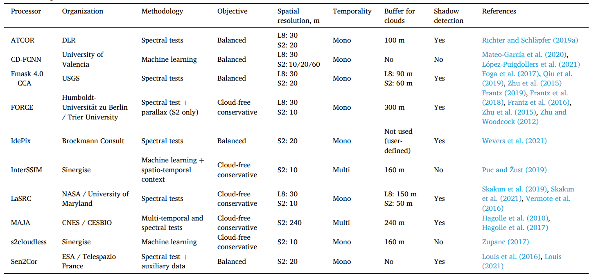
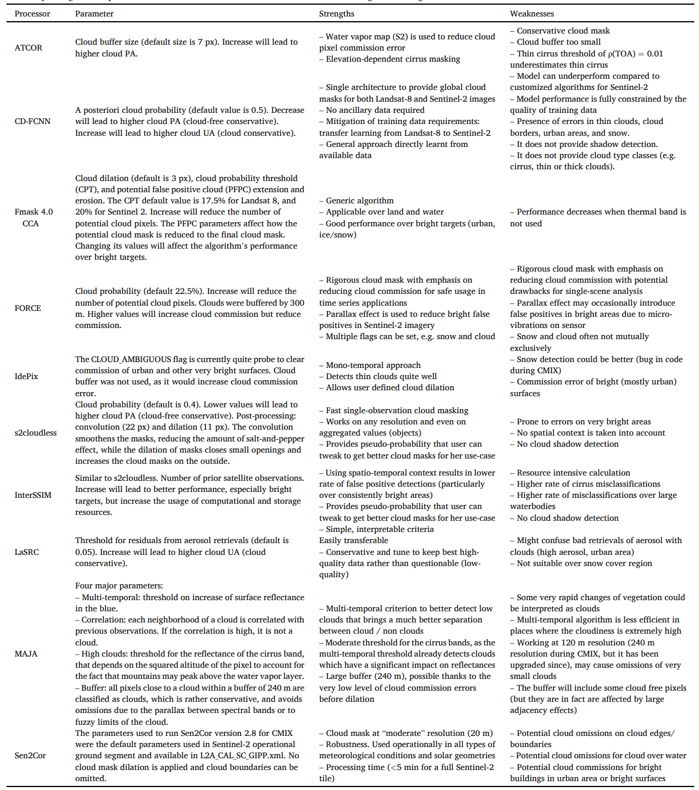

# Existing Algorithms

## Available Algorithms

### CD-FCNN

Opensource and available on [github.com/IPL-UV/DL-L8S2-UV](https://github.com/IPL-UV/DL-L8S2-UV)

### Fmask 4.0

Opensource and available ong [github.com/gersl/fmask](https://github.com/gersl/fmask).

### S2Cloudless

Opensource and available
on [github.com/sentinel-hub/sentinel2-cloud-detector](https://github.com/sentinel-hub/sentinel2-cloud-detector).

is based on gradient boosting algorithm. The model was trained on a large training dataset with global coverage.

It can be executed at any resolution

uses 10 bands: B01, B02, B04, B05, B08, B8A, B09, B10, B11, B12

### InterSSIM

Opensource and available on [github.com/sentinel-hub/eo-learn](https://github.com/sentinel-hub/eo-learn).

is a multi-temporal extention of s2cloudless

### MAJA

Opensource and available on [gitlab.orfeo-toolbox.org/maja/maja](https://gitlab.orfeo-toolbox.org/maja/maja)

the cloud mask are computed at a low 240m/120m resolution

### Sen2Cor

Available on [https://step.esa.int/main/snap-supported-plugins/sen2cor/](https://step.esa.int/main/snap-supported-plugins/sen2cor/)