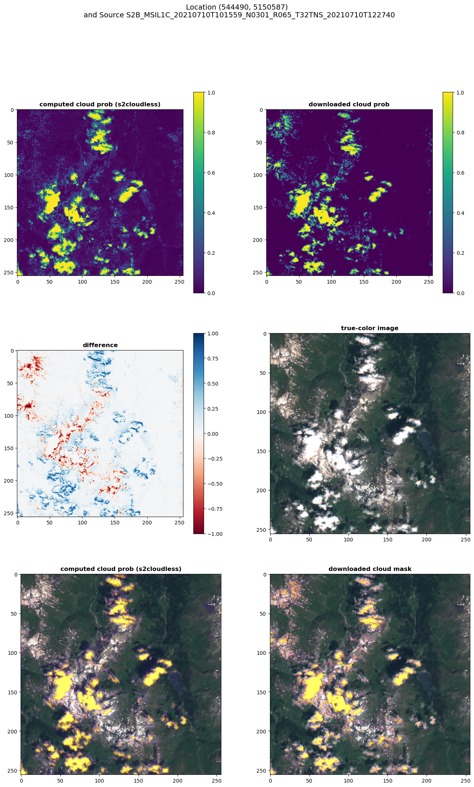
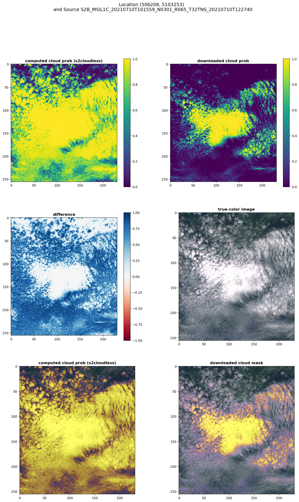
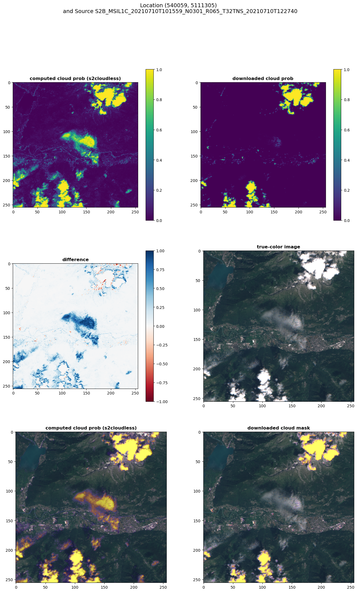
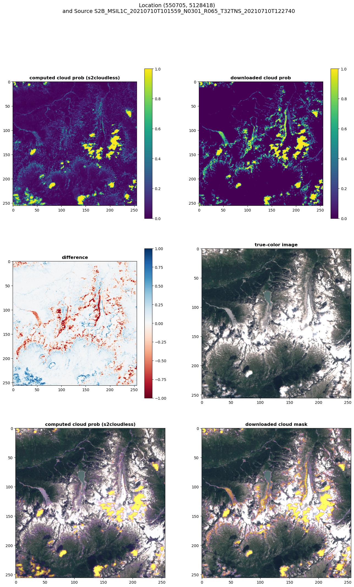
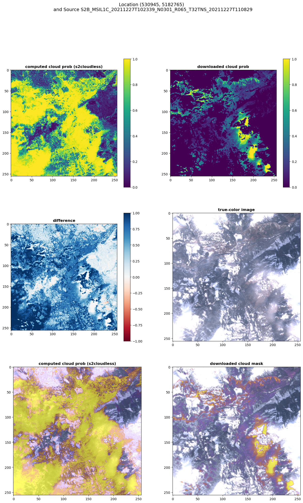

# s2cloudless Model

::: details Installation

If you get a `glibcxx_3.4.30` error, you need to install the following packages:

```bash
conda install -c conda-forge gcc=12.1.0
conda install -c anaconda scipy==1.9.1 
conda install -c conda-forge libstdcxx-ng=12
conda install shapely
```

As
described [on Stackoverflow](https://stackoverflow.com/questions/72540359/glibcxx-3-4-30-not-found-for-librosa-in-conda-virtual-environment-after-tryin).

However, this is not a good solution! Consider a clean installation of the conda environment instead.
Using the `environment.txt` file.

```bash
conda install --file environment.txt
```

:::

The results are somewhat similar, however not always.



Here a significant difference can be seen:


In some situations s2cloudless is significantly better than the downloaded cloud mask:



Or the other way around:


## Strengths of the model

- cloud mask seems to be very accurate for well-defined clouds, e.g. for single, non-connected cumulus clouds (dense clouds).
