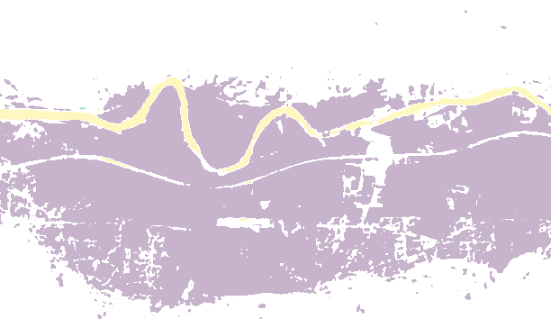

# Unet

Resources for Python Code

- [milesial/Pytorch-UNet/](https://github.com/milesial/Pytorch-UNet/tree/master)
- [U-Net: Training Image Segmentation Models in PyTorch](https://pyimagesearch.com/2021/11/08/u-net-training-image-segmentation-models-in-pytorch/)

## Train the Model

You can train the model using the following command:

```bash
bash helper-scripts/pipeline/pipeline.sh pipeline-config.yml
```

Within the `pipeline-config.yml` you can configure if you wish to train the model or not, i.g. just run inference.

## Latest Results
The following models were trained using the adjusted pre-processing and image splitting pipeline.
The new pipeline has updated the normalization and clipping of the data and is therefore not compatible with older
models.


## Older Models

Currently by best model is `e40b271`. It works reliably in different scenes and seasons.

For older models the image splitter must be set to legacy mode. This can be done by setting inside the `config.py`.

```python
# [...]
LEGACY_MODE = False  # legacy: True
# [...]
PERCENTILE_CLPPING_DYNAMIC_WORLD_METHOD = True  # legacy: False
# [...]
SIGMA_CLIPPING = False
# [...]
```

::: details Git Commit ([e40b271](https://github.com/wp99cp/bachelor-thesis/commit/e40b271)) - 14.04.2023

This was `14235800` slurm job.

Model trained using amp (mixed precision) and AdamW optimizer. Using all 13 bands and the elevation data.
Great performance except for water.

:::

::: details Git Commit ([2d0d993](https://github.com/wp99cp/bachelor-thesis/commit/2d0d993)) - 10.04.2023

That was `14035434` slurm job.

Model trained using amp (mixed precision) and AdamW optimizer. Using all 13 bands and the elevation data.

This model has slow convergence, however it is learning quite well.

```
Epoch: 49, train_loss: 0.074335, test_loss: 0.061889
Metrics for validation of epoch:  49
 - pixel_accuracy___background: 0.9733
 - union_over_inter_background: 0.9346
 - dice_coefficient_background: 0.9666
 - pixel_accuracy___snow: 0.9776
 - union_over_inter_snow: 0.9220
 - dice_coefficient_snow: 0.9597
 - pixel_accuracy___clouds: 0.9820
 - union_over_inter_clouds: 0.9302
 - dice_coefficient_clouds: 0.9641
 - pixel_accuracy___water: 0.9996
 - union_over_inter_water: 0.6934
 - dice_coefficient_water: 0.8009
```

:::

::: details Git Commit ([202ea7d](https://github.com/wp99cp/bachelor-thesis/commit/202ea7d)) - 03.04.2023

Trained based on a hand-selected limited dataset, containing of the bands:

```yml
[ '20210116T102351', '20210215T102121', '20210302T101839', '20210401T101559', '20210406T102021', '20210531T101559', '20210625T102021', '20210720T101559', '20210913T102021', '20211018T101939', '20211028T102039', '20211013T101951' ]
```


### Problems

Huge Problem on scene `20211023T102101`

- false positive clouds in bright snow
- huge problem with water prediction


:::

::: details Git Commit ([8ad1ca2](https://github.com/wp99cp/bachelor-thesis/commit/8ad1ca2)) - 03.04.2023

Trained based on a hand-selected limited dataset, containing of the bands:

```yml
[ '20210116T102351', '20210215T102121', '20210302T101839', '20210401T101559', '20210406T102021', '20210531T101559', '20210625T102021', '20210720T101559', '20210913T102021', '20211018T101939', '20211028T102039', '20211013T101951' ]
```

Additionally, the steps per epoch was limited:

```
STEPS_PER_EPOCH = 1024
STEPS_PER_EPOCH_TEST = 128
```


:::

::: details Git Commit ([a2528d2](https://github.com/wp99cp/bachelor-thesis/commit/a2528d2)) - 02.04.2023

This was slurm id `13611024`

Big mode, trained with 243'712 patches from 35 different dates. All 13 channels and the elevation data were used.
Additionally, the elevation data was used.

The training set has the following class distribution:

```
 Total Class Distribution: [0.41002, 0.29181, 0.29019, 0.00798]
```

Results:


Compared to the model `202ea7d` , the results for scene `20211023T102101` are much better.


Winter scene `20211217T102329`:





:::

::: details Git Commit ([8fe0cea](https://github.com/wp99cp/bachelor-thesis/commit/8fe0cea)) - 02.04.2023

This was slurm id `13611087`.

Big model, trained with 243'712 patches from 35 different dates. All 13 channels and no additional auxiliary data were
used. The training set has the following class distribution:

```
 Total Class Distribution: [0.41002, 0.29181, 0.29019, 0.00798]
```

Results:


:::

::: details Git Commit ([4c654a2](https://github.com/wp99cp/bachelor-thesis/commit/4c654a2)) - 29.03.2023

Trained using auto masks for all images (73) scenes, using 600 samples per date. The training set has the following
class distribution:

```
 Total Class Distribution: [0.27588 0.23729 0.48049 0.00634 0.     ]
« Background, Snow, Clouds, Water, Semi-Transparent Clouds
```

Configuration:

```
 - SAMPLES_PER_DATE = 600
 - IMG_SIZE = 256
 - NUM_ENCODED_CHANNELS = 5
 - SELECTED_BANDS = ['B01', 'B02', 'B03', 'B04', 'B05', 'B06', 'B07', 'B08', 'B8A', 'B09', 'B10', 'B11', 'B12']
 - DATA_DIR = /scratch/tmp.13277407.pucyril/data
 - EXTRACTED_RAW_DATA = /cluster/scratch/pucyril/data_sources/extracted_raw_data
 - MAKS_PATH = /cluster/scratch/pucyril/data_sources/masks
 - DATASET_DIR = /scratch/tmp.13277407.pucyril/data/dataset
 - RESULTS = /scratch/tmp.13277407.pucyril/results
 - LIMIT_DATES = 0

Found 73 dates
```

The model was trained for 7 epochs with a batch size of 16 and image size of 256. The architecture is as follows:

```
-----------------------------------------------------------------------------
         Layer (type)            Input Shape         Param #     Tr. Param #
=============================================================================
             Conv2d-1      [1, 13, 256, 256]           7,488           7,488
        BatchNorm2d-2      [1, 64, 256, 256]             128             128
               ReLU-3      [1, 64, 256, 256]               0               0
             Conv2d-4      [1, 64, 256, 256]          36,864          36,864
        BatchNorm2d-5      [1, 64, 256, 256]             128             128
               ReLU-6      [1, 64, 256, 256]               0               0
          MaxPool2d-7      [1, 64, 256, 256]               0               0
         DoubleConv-8      [1, 64, 128, 128]         221,696         221,696
          MaxPool2d-9     [1, 128, 128, 128]               0               0
        DoubleConv-10       [1, 128, 64, 64]         885,760         885,760
         MaxPool2d-11       [1, 256, 64, 64]               0               0
        DoubleConv-12       [1, 256, 32, 32]       3,540,992       3,540,992
         MaxPool2d-13       [1, 512, 32, 32]               0               0
        DoubleConv-14       [1, 512, 16, 16]      14,159,872      14,159,872
   ConvTranspose2d-15      [1, 1024, 16, 16]       2,097,664       2,097,664
        DoubleConv-16      [1, 1024, 32, 32]       7,079,936       7,079,936
   ConvTranspose2d-17       [1, 512, 32, 32]         524,544         524,544
        DoubleConv-18       [1, 512, 64, 64]       1,770,496       1,770,496
   ConvTranspose2d-19       [1, 256, 64, 64]         131,200         131,200
        DoubleConv-20     [1, 256, 128, 128]         442,880         442,880
   ConvTranspose2d-21     [1, 128, 128, 128]          32,832          32,832
        DoubleConv-22     [1, 128, 256, 256]         110,848         110,848
            Conv2d-23      [1, 64, 256, 256]             260             260
=============================================================================
Total params: 31,043,588
Trainable params: 31,043,588
Non-trainable params: 0
-----------------------------------------------------------------------------
```


:::

::: details Git Commit ([913b2a3](https://github.com/wp99cp/bachelor-thesis/tree/913b2a38017)) - 14.03.2023

Trained on 10_240 of a single scene (20211008T101829) using all 13 bands.

The training set has the following class distribution:

```
CLASS_WEIGHTS = [0.25052, 0.00214, 0.01381, 0.02479]
```

The model was trained for 25 epochs with a batch size of 64. The architecture is as follows:

```
-----------------------------------------------------------------------------
         Layer (type)            Input Shape         Param #     Tr. Param #
=============================================================================
             Conv2d-1      [1, 13, 128, 128]           7,488           7,488
        BatchNorm2d-2      [1, 64, 128, 128]             128             128
               ReLU-3      [1, 64, 128, 128]               0               0
             Conv2d-4      [1, 64, 128, 128]          36,864          36,864
        BatchNorm2d-5      [1, 64, 128, 128]             128             128
               ReLU-6      [1, 64, 128, 128]               0               0
          MaxPool2d-7      [1, 64, 128, 128]               0               0
         DoubleConv-8        [1, 64, 64, 64]         221,696         221,696
          MaxPool2d-9       [1, 128, 64, 64]               0               0
        DoubleConv-10       [1, 128, 32, 32]         885,760         885,760
         MaxPool2d-11       [1, 256, 32, 32]               0               0
        DoubleConv-12       [1, 256, 16, 16]       3,540,992       3,540,992
         MaxPool2d-13       [1, 512, 16, 16]               0               0
        DoubleConv-14         [1, 512, 8, 8]      14,159,872      14,159,872
   ConvTranspose2d-15        [1, 1024, 8, 8]       2,097,664       2,097,664
        DoubleConv-16      [1, 1024, 16, 16]       7,079,936       7,079,936
   ConvTranspose2d-17       [1, 512, 16, 16]         524,544         524,544
        DoubleConv-18       [1, 512, 32, 32]       1,770,496       1,770,496
   ConvTranspose2d-19       [1, 256, 32, 32]         131,200         131,200
        DoubleConv-20       [1, 256, 64, 64]         442,880         442,880
   ConvTranspose2d-21       [1, 128, 64, 64]          32,832          32,832
        DoubleConv-22     [1, 128, 128, 128]         110,848         110,848
            Conv2d-23      [1, 64, 128, 128]             260             260
=============================================================================
Total params: 31,043,588
Trainable params: 31,043,588
Non-trainable params: 0
-----------------------------------------------------------------------------
```

Prediction on a single image (I selected a particular accurate result, in general the results are not that good):


:::

