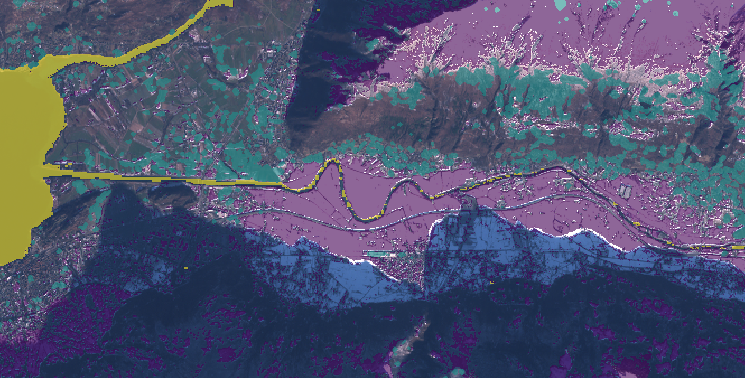
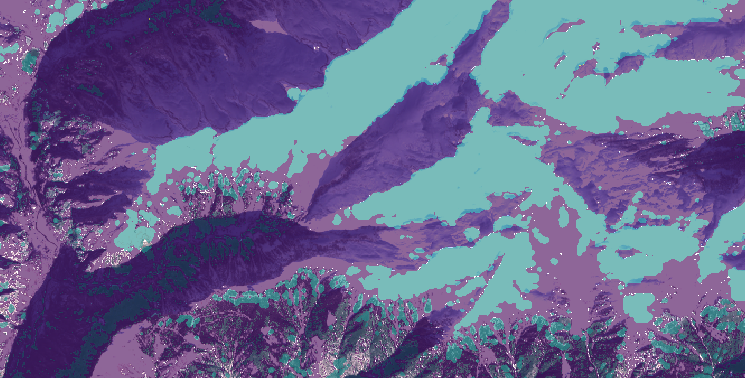

# Manually Edited and Cleanup Masks

Especially for winter days the training data are of bad quality. Therefore, we manually edit and clean up the training
data.

## Manually Edited Masks

The following masks are manually checked, cleaned up and edited:

The existing mask was calculated combining the ExoLab snow mask, s2cloudless for clouds and `32TNS_10m_COP_Lakes`
combined with `32TNS_30m_JRC_surfaceWater` for water.

To help with the cleanup you can use the jupyter notebook: `cleanup.ipynb`.

| Date              | Description of Scene                                                                                                                                  | Method                                                                                                                                                                                      |
|-------------------|-------------------------------------------------------------------------------------------------------------------------------------------------------|---------------------------------------------------------------------------------------------------------------------------------------------------------------------------------------------|
| `20210111T102309` | Winter day with fresh snow in the valleys, no clouds                                                                                                  | Combine prediction of `a2528d2` with original mask, convert clouds to snow. Some miss classifications in water layer. No clouds, snow is quite accurate, some artifacts in big areas...     |
| `20210116T102351` | Winter day with fresh snow in the valleys, some clouds in the north, west                                                                             | Combine prediction of `a2528d2` with original mask. In cloud free areas cloud prediction was converted to snow, in the cloud area, clouds prediction are intersected between the two masks. |
| `20210121T102239` | Very cloudy day with some cloud free spots in the north                                                                                               | Combine prediction of `a2528d2` with original mask.  The south is ignored and removed from the mask_coverag, as the south is completely covered by clouds.                                  |
| `20210126T102311` | Clouds coming from north, north is cloudy, south has some small clouds                                                                                | Manually mark clouds in the south (using points) calculate mask by approximation to annotated clouds                                                                                        | 
| `20210131T102149` | Clouds in the south-east, one cloud band from north to south, snow in cloud-free areas                                                                | Use prediction of `2d0d993` as mask. This has better accuracy in clouds over the mountains                                                                                                  |
| `20210215T102121` | Some clouds in the corner (north-west), otherwise cloud free apart from 1-3 clouds over the mountains                                                 | Replaced with prediction of `2d0d993` as it captures the water better                                                                                                                       |
| `20210220T101939` | Some Clouds in the South-West, Clear Sky in the North                                                                                                 | Removed false positive clouds in the north, merge prediction of water with clouds and snow form existing algorithms. Algorithm used for water `2d0d993`                                     |
| `20210225T102021` | Clear winter day, in the north snow in the valleys, no snow in the south valleys                                                                      | keep original mask                                                                                                                                                                          | 
| `20210302T101839` | Clear winter day, snow free valleys in the south                                                                                                      | Keep original mask but remove all clouds in the north and west (as those are miss classified)                                                                                               | 
| `20210307T102021` | Some clouds in the north, clear sly in the south                                                                                                      | Manually removed some clouds and replaced their mask with snow. Otherwise the original mask was used.                                                                                       |
| `20210322T101649` | Many clouds in the north, some clouds in the south                                                                                                    | Manually removed some small clouds in the south valley as those are false positives. otherwise keep existing mask                                                                           |
| `20210401T101559` | Cloud free spring day, mountains still covered in snow                                                                                                | Remove all clouds form the mask                                                                                                                                                             | 
| `20210406T102021` | Spring days, heavy clouds coming from north-west, however there are still some free spots in between. Original mask is has many false positive clouds | Many miss classifications in clouds. Removed part of them but not all                                                                                                                       |
| `20210416T102021` | Heavy clouds coming from south-west                                                                                                                   | remove some miss classified clouds in the deep valleys                                                                                                                                      | 
| `20210526T102021` | Small clouds everywhere                                                                                                                               | Removed some clouds manually (over forst areas in valleys                                                                                                                                   |
| `20210531T101559` | Small clouds everywhere                                                                                                                               | keep original mask                                                                                                                                                                          |
| `20210610T101559` | Spring day with many some clouds on the mountain tops                                                                                                 | keep original mask                                                                                                                                                                          |
| `20210615T102021` | Summer day with little clouds in the south                                                                                                            | remove some miss classifications over riverbed                                                                                                                                              | 
| `20210625T102021` | Summer day with thick clouds in the north, clouds over the mountain tops in the south                                                                 | keep original mask                                                                                                                                                                          |
| `20210705T102031` | North fully covered in clouds, south is clear                                                                                                         | keep original mask                                                                                                                                                                          |
| `20210710T101559` | Summer day with small patches of snow, some clouds over the mountain tops                                                                             | replace mask with prediction of `a2528d2` to improve water accuracy                                                                                                                         |
| `20210720T101559` | Summer day with small cloud-free patches of snow, some clouds                                                                                         | replace mask with prediction of `a2528d2` to improve water accuracy                                                                                                                         |
| `20210730T101559` | South fully covered in clouds, north has some clear spots                                                                                             | replace mask with prediction of `a2528d2` to improve water accuracy                                                                                                                         |
| `20210814T102031` | Summer day with very little clouds                                                                                                                    | replace mask with prediction of `a2528d2`, remove some false positive clouds over brown/bright mountain sides                                                                               |
| `20210819T101559` | South South-west totally covered with clouds, in the north some clouds over the mountains                                                             | replace mask with prediction of `a2528d2`, remove some false positive water over brown/bright mountain sides                                                                                |
| `20210824T102031` | North fully covered, south is cloudy                                                                                                                  | keep original mask                                                                                                                                                                          |
| `20210903T102021` | Very cloudy day but with some clear patches	                                                                                                          | replace mask with prediction of `a2528d2`, remove south from mask_coverage due to thin clouds                                                                                               |
| `20210908T101559` | South fully covered (except some parts of the southern valley), north is cloudy	                                                                      | replace mask with prediction of `a2528d2`                                                                                                                                                   |
| `20210913T102021` | Some clouds over the mountain tops otherwise clear autumn day                                                                                         | combine cloud prediction of `a2528d2` with original mask, water from prediction                                                                                                             |
| `20210918T101639` | Some clouds in the south, north fully cloud free                                                                                                      | replace mask with prediction of `a2528d2`, remove some false positive water over brown/bright mountain sides                                                                                |
| `20211008T101829` | Some fresh snow in the mountains, some clouds in the south                                                                                            | combine cloud prediction of `a2528d2` with original mask, water from prediction                                                                                                             |
| `20211013T101951` | Nearly now snow on the south, some on the north with some clouds, heavy clouds coming from north-west                                                 | keep original                                                                                                                                                                               |
| `20211018T101939` | Cloudless day with very little snow                                                                                                                   | keep original                                                                                                                                                                               |
| `20211028T102039` | Cloud free day with very little snow, typical autumn day                                                                                              | replace mask with prediction of `a2528d2`, replace clouds with snow                                                                                                                         |
| `20211102T102201` | Fresh snow, clouds in the north	                                                                                                                      | replace mask with prediction of `a2528d2`                                                                                                                                                   |
| `20211112T102251` | Snow in the mountains, little clouds                                                                                                                  | keep original, but could be improved                                                                                                                                                        |

## Common Problems with the Autogenerated Masks:

--> `20210111T102309`: many small background areas which are wrongly classified as clouds, snow in the shadow areas
is not classified as snow.

--> `20210111T102309`: In south facing areas, the snow is very bright and therefore wrongly classified as clouds.

