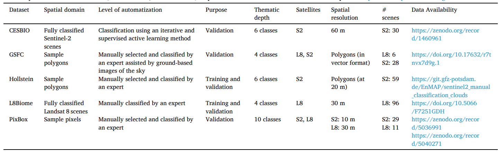
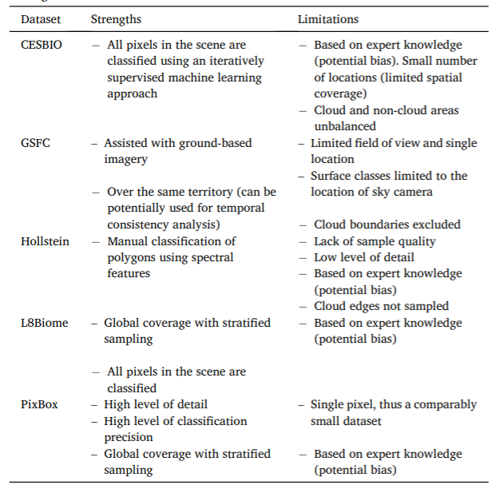

# Data Sources and Pre-Processing

This page describes where I get my data from and how I pre-process it.

## Data Sources

For my project, I use earth observation data from two satalites:

- from the [Sentinel-2](https://sentinel.esa.int/web/sentinel/missions/sentinel-2) satellite.

::: info

Sentinel-2 is an Earth observation mission from the Copernicus Programme that systematically acquires optical imagery at
high spatial resolution over land and coastal waters. See [Wikipedia](https://en.wikipedia.org/wiki/Sentinel-2).

:::

- from the [Landsat-8](https://landsat.gsfc.nasa.gov/landsat-8/) satellite.

::: info
LandSat-8 is an Earth observation satellite from the United States.
See [Wikipedia](https://en.wikipedia.org/wik i/Landsat_8).
:::

The data is available for free from the [Copernicus Open Access Hub](https://scihub.copernicus.eu/dhus/#/home).

## Available Data

Source: Skakun et al. (2022), Cloud Mask Intercomparison eXercise (CMIX): An evaluation of cloud masking algorithms for Landsat 8 and Sentinel-2

## Downloaded Data

The data is already downloaded and stored in `pf/pfstud/nimbus/downloaded_data`.